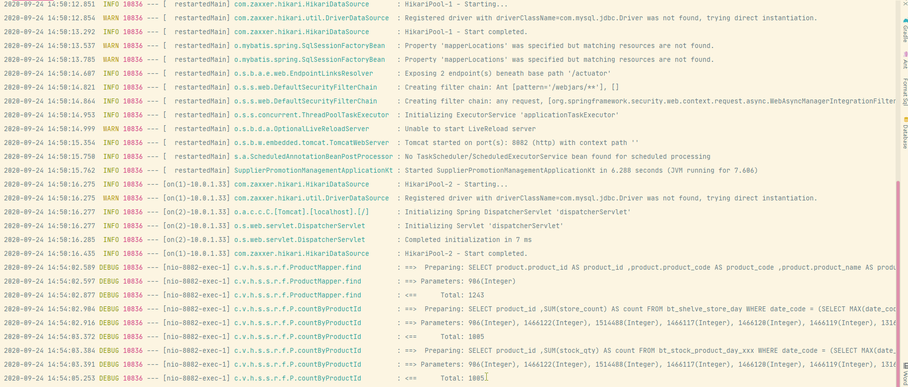
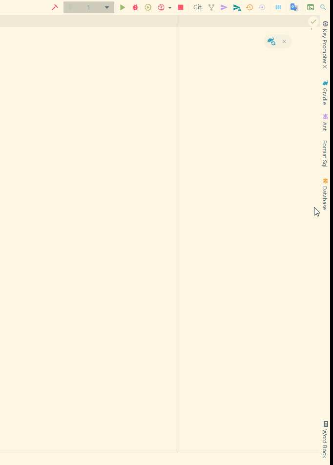
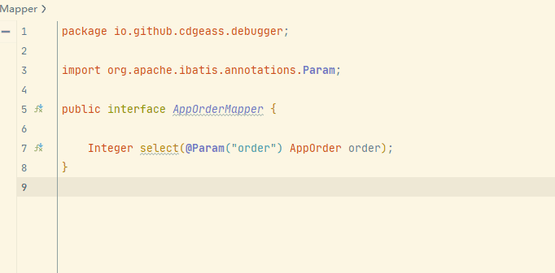
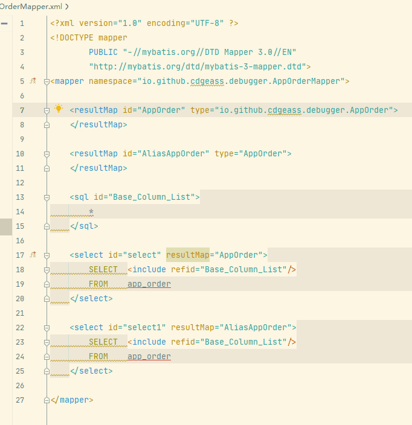
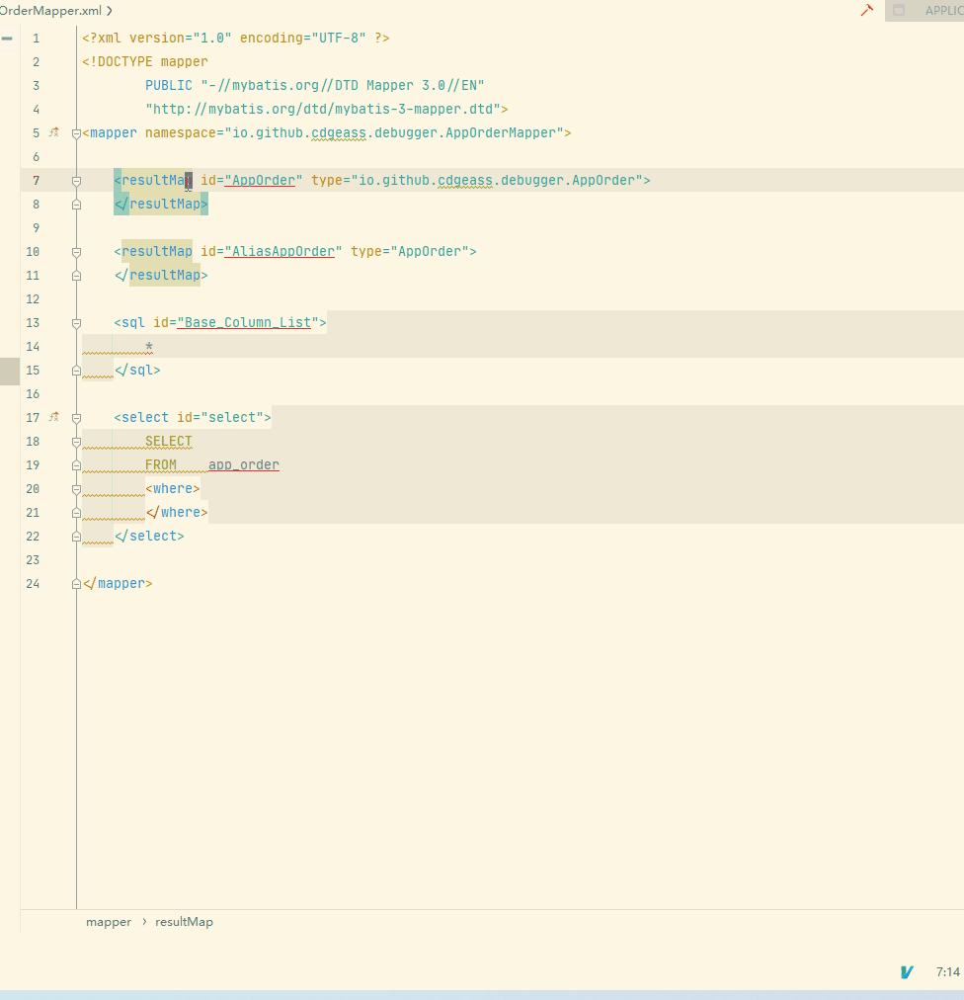

# my-mybatis plugin
This is a plugin to help you to use mybatis in Intellij IDEA.

## Features

- Format mybatis log
    - in the console  
      
    - in the tool window
    

- Code jump
    - jump between the interface and xml
    
    - jump between xml tag
    
    
- Code completion

## Installation
- Using IDE built-in plugin system on Windows:
    - <kbd>File</kbd> > <kbd>Settings</kbd> > <kbd>Plugins</kbd> > <kbd>Browse repositories...</kbd> > <kbd>Search for "my-mybatis"</kbd> > <kbd>Install Plugin</kbd>
- Using IDE built-in plugin system on MacOs:
  - <kbd>Preferences</kbd> > <kbd>Settings</kbd> > <kbd>Plugins</kbd> > <kbd>Browse repositories...</kbd> > <kbd>Search for "my-mybatis"</kbd> > <kbd>Install Plugin</kbd>
- Manually:
  - Download the [latest release](https://github.com/cdgeass/my-mybatis-plugin/releases/latest) and install it manually using <kbd>Preferences</kbd> > <kbd>Plugins</kbd> > <kbd>Install plugin from disk...</kbd>

## License

[GPL © cdgeass.](LICENSE)